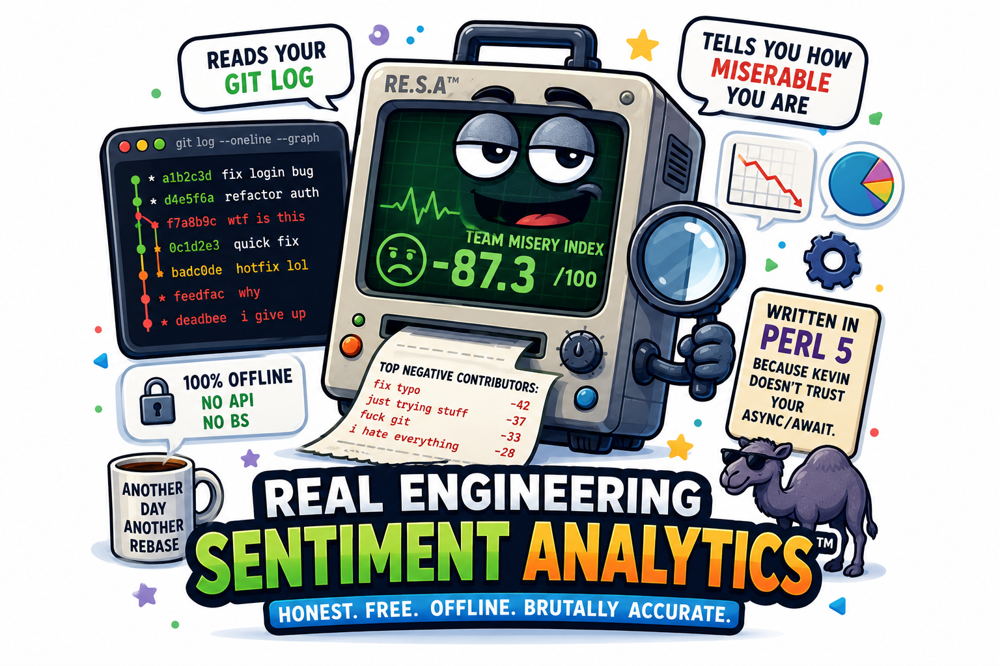
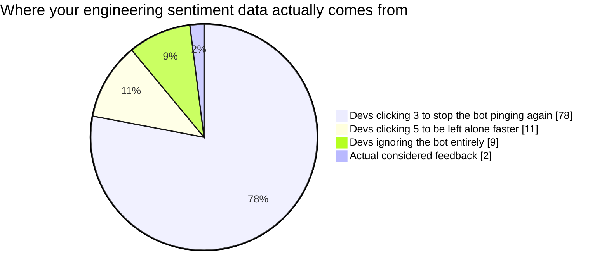
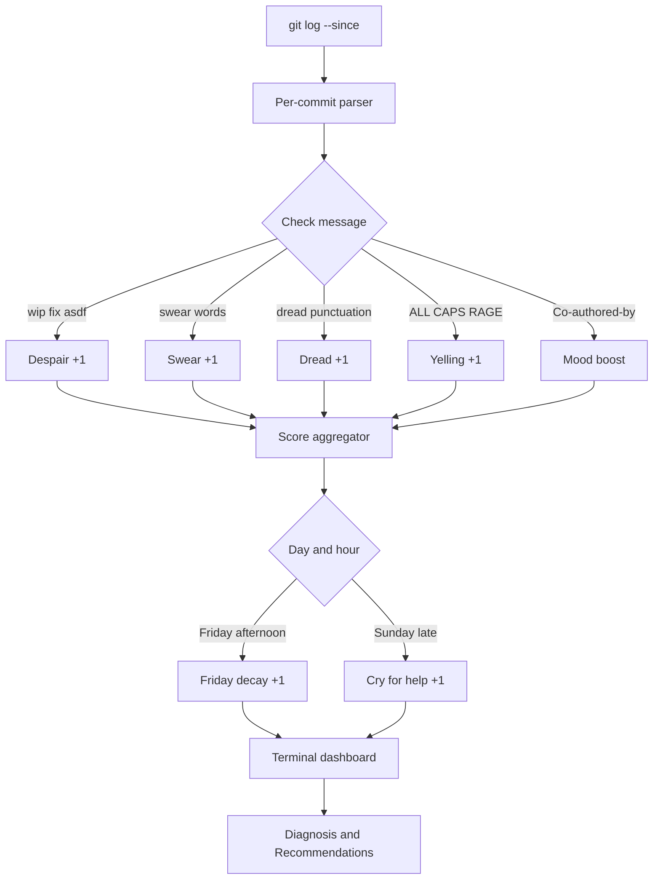

<!--
  Hero image placeholder.
  Drop ./mood-ring-hero.png in the repo root once Kevin has decided
  what mood Kevin himself is in today.
-->
<div align="center">
  
</div>

# 🧠 commit-mood-ring

> *"I read 2,400 of your commit messages this weekend.*
> *Your team is not okay."*
> *— Kevin Sigmoid, 2026*

**Real Engineering Sentiment Analytics™ — but actually honest, free, and offline.**

[](LICENSE)
[](https://www.perl.org)
[]()
[]()
[]()
[](https://github.com/kevin-sigmoid-org)
[]()

---

## 🤔 The Problem

Your DSI just signed a 50,000 €/year contract with *Plural.dev* / *DevHealthScore* / *EngagementHQ* / pick-your-vendor to "*continuously measure your engineering team's wellbeing through advanced sentiment analytics*".

The vendor's product is a Slack bot that pings your devs once a week:

> *"On a scale of 1 to 5, how was your week? 🌧️ → ☀️"*

Your devs answer "**3**" every single week, regardless of whether they shipped a feature or just got paged at 03:00 for the seventh time. The vendor's dashboard shows your team's mood is **stable at 3/5**. The CTO is reassured. Nobody is reassured.



There is, however, **one source** of unfiltered, time-stamped, attributable, multilingual data your team produces every single day, without thinking, without performing:

**The commit messages.**

---

## 🧠 What `commit-mood-ring` does

It reads your `git log`. It applies a corpus of heuristics — swearing, despair signals, Friday-afternoon decay, Sunday-night trauma, ALL-CAPS rage — and it gives you a dashboard.

```
🧠 ENGINEERING MOOD REPORT
────────────────────────────────────────────────────────────────
  Repo:            oculix-org/Oculix
  Window:          1 year ago
  Commits scanned: 247
  Languages:       en, fr, de, es
  Authors:         3
────────────────────────────────────────────────────────────────

  OVERALL MOOD                     ████████░░  82%  🙂
  DESPAIR INDEX                    ███░░░░░░░  31%
  FRIDAY-AFTERNOON COEFFICIENT     ████████░░  74%  ⚠️
  SUNDAY-NIGHT TRAUMA              ███░░░░░░░  31%
  EXISTENTIAL DREAD                █░░░░░░░░░  12%

────────────────────────────────────────────────────────────────
🩺 DIAGNOSIS
────────────────────────────────────────────────────────────────

  Your team appears functional and possibly even content.
  Kevin is suspicious. Are they lying in the commits?
  Check their Slack DMs to be sure.

  KEY OBSERVATIONS:
  - Friday afternoons are 74% degraded. Cancel the Friday standup.
  - 47 commits are co-authored. Pair-programming detected. Mood +.

────────────────────────────────────────────────────────────────
📜 RECOMMENDED INTERVENTIONS
────────────────────────────────────────────────────────────────

  1. Keep doing what you are doing.
  2. But not too much. Hubris is a soft skill.
  3. Maybe write a blog post. Kevin will not read it.
  5. Cancel Friday standup. Friday afternoon is not for ceremonies.

────────────────────────────────────────────────────────────────
  Kevin Sigmoid Industries · v0.1.0 · AGPL-3.0 · Kevin validated this.
```

---

## 🛠️ How it works



---

## 🧪 The Science™

```
Mood = 100 - (3·swears + 2·despair + dread + 4·rage) × 100 / total_commits
       + co_authored_boost
```

Where:
- `swears` weighs 3× because Kevin respects honesty
- `despair` ("wip", "fix", "asdf") weighs 2× because it's structural
- `rage` weighs 4× because rage is rare and meaningful
- `co_authored_boost` adds mood, because pair-programming is community

This is, statistically, **not science**. It is, however, **better than what your $50,000/year vendor is doing**.

**Multilingual corpus** — what each language contributes to the despair index:

| Language | Patterns scanned |
|---|---|
| 🇬🇧 **English** | swear words · `asdf` · `ugh` · `argh` · `nope` · `broken` · `hate` |
| 🇫🇷 **Français** | `putain` · `merde` · `chiant` · `naze` · `n'importe quoi` |
| 🇩🇪 **Deutsch** | `scheisse` · `verdammt` · `mist` · `kacke` |
| 🇪🇸 **Español** | `mierda` · `joder` |
| 🌐 **Universal** | dread punctuation (`???`, `!!!`, `...`) · `wip` / `fix` / `asdf` · ALL CAPS RAGE · `please work` · `last try` |

---

## 📦 Installation

`commit-mood-ring` is a single Perl 5 script with **zero CPAN dependencies**. You need Perl 5.10+ (released 2007 — basically every Perl in existence).

### Mac

```bash
# Perl is pre-installed. Of course it is. Apple ships Perl since OS X 10.0 (2001).
perl --version
git clone https://github.com/kevin-sigmoid-org/commit-mood-ring.git
cd commit-mood-ring
perl mood-ring.pl --help
```

### Linux

```bash
# Perl is pre-installed on every distro since the dawn of time.
perl --version
git clone https://github.com/kevin-sigmoid-org/commit-mood-ring.git
cd commit-mood-ring
perl mood-ring.pl --help
```

### Windows

You need Perl. Choose your fighter:

- **Strawberry Perl** (recommended) → https://strawberryperl.com → "Standalone Perl distribution. Bundles a C compiler. Just works."
- **ActiveState Perl** → https://www.activestate.com/products/perl → corporate option, slightly heavier
- **Git Bash / WSL** → Perl already there, you're done

```cmd
perl --version
git clone https://github.com/kevin-sigmoid-org/commit-mood-ring.git
cd commit-mood-ring
perl mood-ring.pl --help
```

---

## 🚀 Usage

```bash
# Analyse the current repo, last year, all languages of despair:
perl mood-ring.pl

# Only the last 3 months on a specific repo:
perl mood-ring.pl --repo ../my-shame --since '3 months ago'

# French despair only (regional crisis mode):
perl mood-ring.pl --lang fr

# All branches, not just the current one (= the messy reality):
perl mood-ring.pl --all

# Include commits from deleted branches still in the local reflog
# (= the ghosts of features past). Kevin does NOT chase GitHub deletions:
perl mood-ring.pl --include-deleted

# Verbose per-commit forensics, no color, ready for that anonymous tip:
perl mood-ring.pl --verbose --no-color > engineering-distress.txt

# Show the full help (recommended — Kevin has put effort into it):
perl mood-ring.pl --help
```

### Scope of analysis

| Mode | What gets scanned |
|---|---|
| *default* | Current branch only — clean, but partial |
| `--all` | Every existing branch, local + remote — the messy reality |
| `--include-deleted` | All of the above, plus commits still findable in your local `reflog` from deleted branches |

Commits that have been **garbage-collected** (deleted branch + `git gc` passed + no other ref) are gone. Kevin will not chase them. *Kevin has principles.*

Full options in `--help`. Kevin wrote it himself. Read it at least once.

---

## 🤓 Why Perl 5?

Because Kevin doesn't trust your async/await.

More seriously:

| Reason | Detail |
|---|---|
| **Cross-platform without drama** | Mac, Linux, Windows. No Docker. No `node_modules`. No "please install pyenv first". |
| **Zero dependencies** | The script imports `Getopt::Long`, `Term::ANSIColor`, `POSIX`. All three are in Perl's standard library since 2008. |
| **Regex are native** | This is fundamentally a regex problem. Perl IS the regex language. |
| **Vintage that holds up** | The same script will run on Perl 5.10 (2007) and Perl 5.42 (2025). Kevin doubts your TypeScript project from last year still builds. |
| **Aesthetic** | The shebang `#!/usr/bin/perl` is the unmistakable signature of "this was written by someone who knows what they're doing, or someone who very much pretends to". |

---

## 🤝 Contributing

Found a bug? Open an issue.
Have a new swear word in your language? Open a PR — Kevin embraces all forms of honesty.
Want to tell Kevin Perl is dead? Kevin knows. Kevin is still here.

```
Kevin Sigmoid — "Perl was supposed to die in 2007.
                 So were standups.
                 We have all been disappointed."
```

---

## 📜 License

**AGPL-3.0.** Use it. Fork it. Inflict it on your DSI before they renew the *Plural.dev* contract. If you run a modified version as a SaaS, you owe your users the source. Kevin chose this license on purpose: corporate tooling vendors are *exactly* the audience that needs to give back when they pump open-source for resale.

---

*Built with strong opinions and weaker indentation conventions.*
*Cross-platform. Stdlib only. Kevin validated this.*

<div align="center">
  <sub>Part of the <a href="https://github.com/kevin-sigmoid-org">Kevin Sigmoid Industries</a> ™ unhinged tools collection.</sub>
</div>
